# [PERSONAL FINANCE TRACKER](https://aa-personal-finance-tracker-46a2e4082ae9.herokuapp.com)

## Project Purpose

This app will enable users to calculate their monthly disposable income, based upon input of their monthly income and expenditure, and also indicate their total weekly, monthly and annual expenditure.

Users can enter figures into 15 pre-defined expenditure fields and then add their own if necessary.

Output will consist of a list of all expenditure items and a financial summary showing their disposable income (or deficit) and total weekly, monthly and annual expenditure.

## Target Audience

The target audience is adults who wish review their ongoing finances, and the pre-defined expenditure fields allow for a range of lifestyles with the option of adding categories more personal to the user.

The image below shows how the app is displayed on various devices.

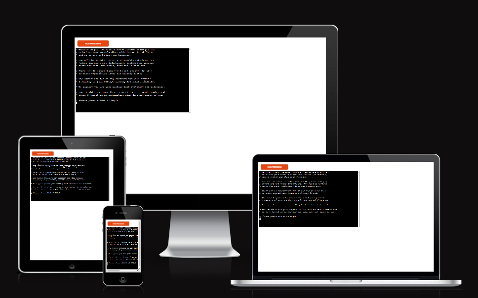

## UX

### Initial Design
The overall design is informed by Code Institute's command line interface (CLI) template, to be deployed on Heroku, with the terminal set to 80 columns by 24 rows.

-   **Before coding, I planned the flow of the application.**

-   **Firstly, with a flow chart using MS Word:**

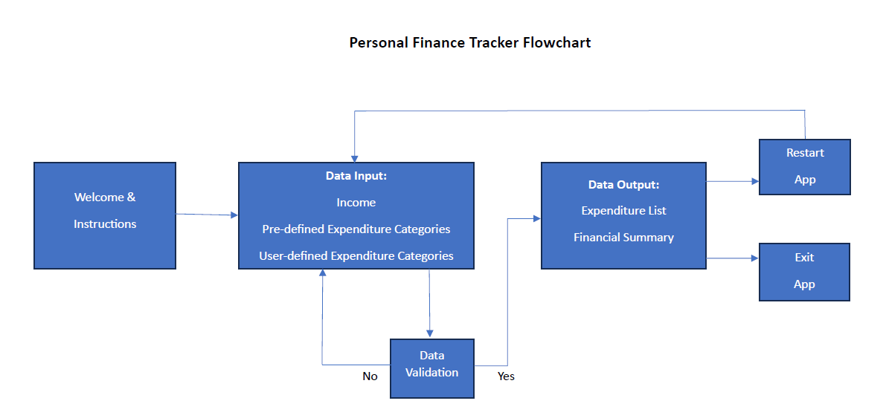

-   **Secondly, with a more detailed written framework:**

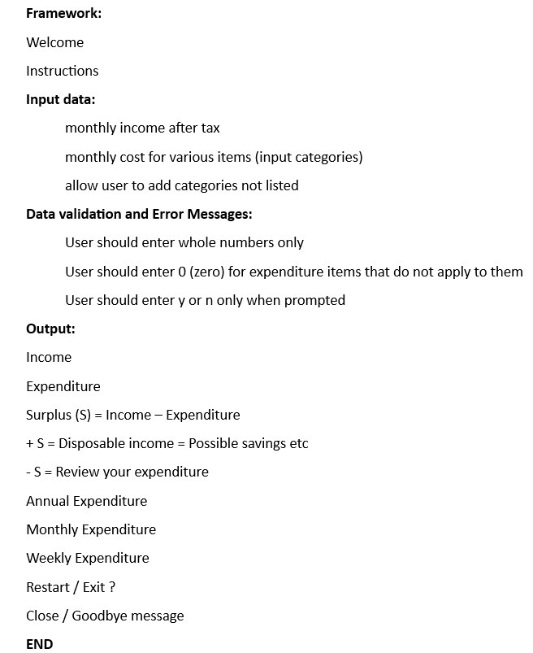

-   **And finally, with a draft script with text to include in the code:**

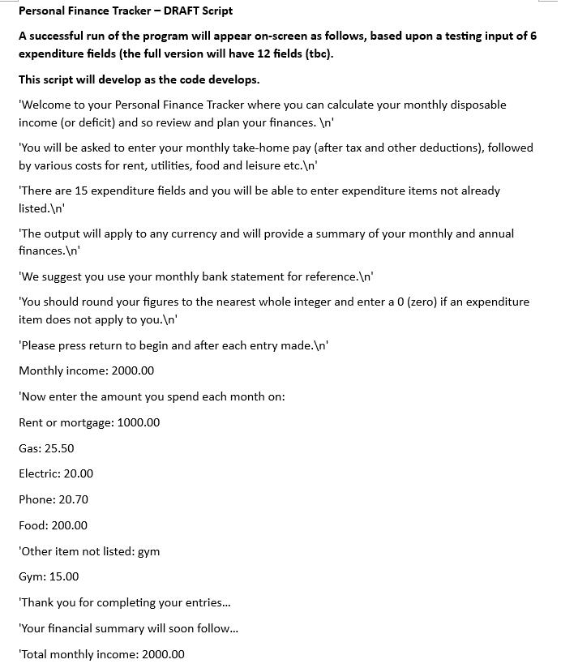

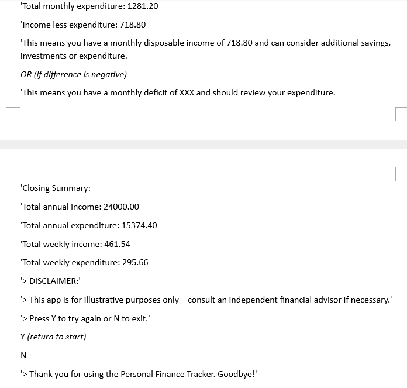

### Typography

The CLI template uses Courier New.

## User Stories

As a user, I would like to see instructions about the app so that I can use it.

As a user, I would like to enter my financial data effectively.

As a user, I would like to enter my own expenditure categories. 

As a user, I would like to see a summary of my finances and disposable income.

As a user, I would like to restart the app to use again or exit.

## Features

### Existing Features

- **Welcome and Instructions**
    - The first page welcomes the user to the app, outlines its purpose, and presents a clear set of instructions. The user is invited to press RETURN to begin.

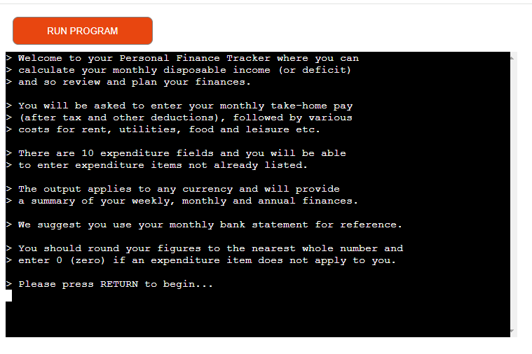

- **Income Input**
    - The user is invited to enter their monthly income, instructed to press RETURN after entry, and after every subsequent data entry.

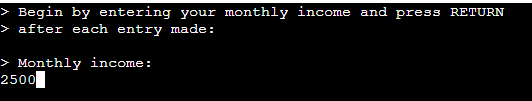

- **Pre-defined Expenditure Input**
    - The first of 15 pre-defined expenditure fields is displayed (Rent or mortgage) and the user is invited to enter the amount they spend in each category.
    - The second item displayed is Travel.

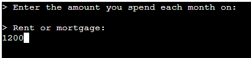

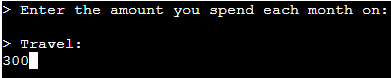

-   **The 15 pre-defined expenditure categories are:**
    -   Rent or mortgage
    -   Travel
    -   Council tax
    -   Food
    -   Childcare
    -   Pension contributions
    -   Savings
    -   Broadband
    -   Electricity
    -   Gas
    -   Water rates
    -   Insurance
    -   Phone
    -   TV licence
    -   Entertainment

- **User-defined Expenditure Input**
    - After running through the 15 pre-defined items, the user is asked if they want to enter their own expenditure items.
    - If they reply with a Y (or y) for yes, they are asked to enter the name of their item and then enter its cost. Two user entries are shown below.

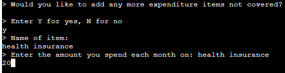

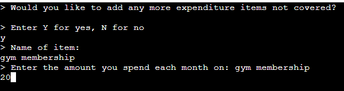

- **No More Expenditure Input Required**
    - The user can enter N (or n) for no and will be taken to the next feature.

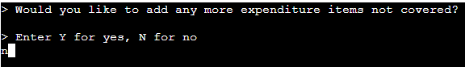

- **Expenditure Summary**
    - All the user's expenditure items and costs are listed and the total monthly expenditure shown. If entered, their own items have been capitalised in the list eg. Health insurance and Gym membership.
     - The user is then invited to press RETURN to take them to their financial summary.

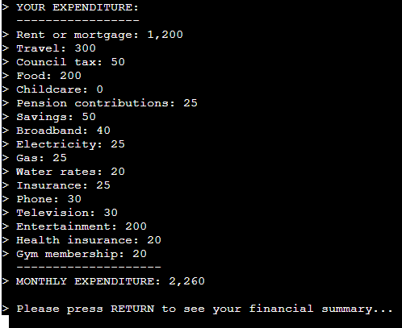

- **Financial Summary**
    - The user is presented with a summary of their monthly income and expenditure, and an indication of whether they have disposable income, a deficit, or spend exactly the same as they earn. 
    - There is also a summary of annual and weekly income and expenditure.
    - Shown below are the three possible outcomes for a surplus (disposable income), a deficit, or income matching expenditure.

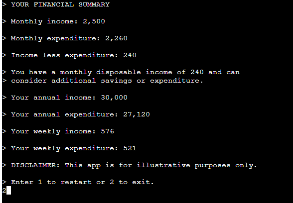

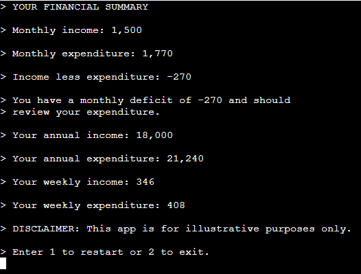

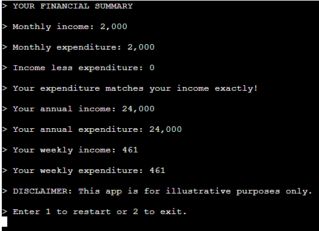

- **Restart or Exit and Closing Message**
    - As shown in the three images above, the user may enter 1 to restart or 2 to exit the app. Restart returns the user to the Income Input feature and exit signs off with a closing message.

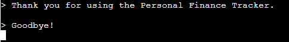

### Future Features

- **Text Colour**
    - Use [colorama](https://pypi.org/project/colorama/) to add colour to CLI text eg. red for the deficit figures and bold for other text.
- **Currency Symbols**
    - Ask user to choose currency symbols and apply these to the output using [currency-symbols](https://pypi.org/project/currency-symbols/)
- **Decimal Places**
    - Add two decimal places function to give a more precise output for the user – **check with Tim about this.**

## Tools & Technologies Used

- [Python](https://www.python.org) used as the back-end programming language.
- [Git](https://git-scm.com) used for version control. (`git add`, `git commit`, `git push`)
- [GitHub](https://github.com) used for secure online code storage.
- [Gitpod](https://gitpod.io) used as a cloud-based IDE for development.
- [Heroku](https://www.heroku.com) used for hosting the deployed back-end site.

## Data Model

The app uses Python to adopt an Object Oriented Programming (OOP) framework.

A dictionary of **key:value** pairs is initiated ie. `finance_dict` with 15 **keys** assigned to the pre-defined expenditure items, and their respective monetary **values** assigned according to the user input (and reset when the app restarts).

### Functions

**The primary functions used are:**

`def clear()`
-   Clears the terminal window.

`def setup_dict()`
-   Initiates dictionary for expenditure items.

`def start_app()`
-   Welcome messages and instructions.

`def get_income()`
-   Gets income data input by the user.
-   Runs a while loop to ensure input data is a whole number or 0.

`def get_expenditure(data)`
-   Gets expenditure data input by the user.
-   Updates the finance_dict with these values.

`def ask_user_item()`
-   Asks user if they wish to enter more expenditure items.
-   Validates input data for yes or no options.

`def get_user_item()`
-   Asks user to input name of expenditure item and amount.
-   Updates the finance_dict with this key and value.

`def calculate_total_expenditure(data)`
-   Calculates total monthly expenditure.

`def item_list(data)`
-   Gets finance_dict and print list of all expenditure items.
-   Adds a thousand comma separator to monthly expenditure output.
-   Prints monthly expenditure.

`def calculate_monthly_surplus(income, expenditure)`
-   Subtracts expenditure from income to calculate surplus.
-   Adds a thousand comma separator to output figures.
-   Prints out summary of financial data with messages.

`def closing_summary()`
-   Calculates annual and weekly finance figures.
-   Adds a thousand comma separator to output figures.
-   Prints out summary of financial data with messages.
-   Asks user to restart or exit.

`def restart_or_close()`
-   Returns to income input if user enters 1.
-   Exits app and prints closing message if user enters 2.

### Imports

I've used the following Python package:
- `os`: used for adding the `clear()` function.

## Testing

For all testing, please refer to the [TESTING.md](TESTING.md) file.

## Deployment

Code Institute has provided a [template](https://github.com/Code-Institute-Org/python-essentials-template) to display the terminal view of this backend application in a modern web browser.
This is to improve the accessibility of the project to others.

The live deployed application can be found deployed on [Heroku](https://aa-personal-finance-tracker-46a2e4082ae9.herokuapp.com).

### Heroku Deployment

This project uses [Heroku](https://www.heroku.com), a platform as a service (PaaS) that enables developers to build, run, and operate applications entirely in the cloud.

Deployment steps are as follows, after account setup:

- Select **New** in the top-right corner of your Heroku Dashboard, and select **Create new app** from the dropdown menu.
- Your app name must be unique, and then choose a region closest to you (EU or USA), and finally, select **Create App**.
- From the new app **Settings**, click **Reveal Config Vars**, and set the value of KEY to `PORT`, and the value to `8000` then select *add*.
- If using any confidential credentials, such as CREDS.JSON, then these should be pasted in the Config Variables as well.
- Further down, to support dependencies, select **Add Buildpack**.
- The order of the buildpacks is important, select `Python` first, then `Node.js` second. (if they are not in this order, you can drag them to rearrange them)

Heroku needs two additional files in order to deploy properly.

- requirements.txt
- Procfile

You can install this project's **requirements** (where applicable) using:

- `pip3 install -r requirements.txt`

If you have your own packages that have been installed, then the requirements file needs updated using:

- `pip3 freeze --local > requirements.txt`

The **Procfile** can be created with the following command:

- `echo web: node index.js > Procfile`

For Heroku deployment, follow these steps to connect your own GitHub repository to the newly created app:

Either:

- Select **Automatic Deployment** from the Heroku app.

Or:

- In the Terminal/CLI, connect to Heroku using this command: `heroku login -i`
- Set the remote for Heroku: `heroku git:remote -a personal-finance-tracker` **CHECK WITH TIM (replace *app_name* with your app name)**
- After performing the standard Git `add`, `commit`, and `push` to GitHub, you can now type:
	- `git push heroku main`

The frontend terminal should now be connected and deployed to Heroku!

### Local Deployment

This project can be cloned or forked in order to make a local copy on your own system.

For either method, you will need to install any applicable packages found within the *requirements.txt* file.

- `pip3 install -r requirements.txt`.

If using any confidential credentials, such as `CREDS.json` or `env.py` data, these will need to be manually added to your own newly created project as well.

#### Cloning

You can clone the repository by following these steps:

1. Go to the [GitHub repository](https://github.com/Adam-Alive/personal-finance-tracker) 
2. Locate the Code button above the list of files and click it 
3. Select if you prefer to clone using HTTPS, SSH, or GitHub CLI and click the copy button to copy the URL to your clipboard
4. Open Git Bash or Terminal
5. Change the current working directory to the one where you want the cloned directory
6. In your IDE Terminal, type the following command to clone my repository:
	- `git clone https://github.com/Adam-Alive/personal-finance-tracker.git`
7. Press Enter to create your local clone.

Alternatively, if using Gitpod, you can click below to create your own workspace using this repository.

Please note that in order to directly open the project in Gitpod, you need to have the browser extension installed.
A tutorial on how to do that can be found [here](https://www.gitpod.io/docs/configure/user-settings/browser-extension).

#### Forking

By forking the GitHub Repository, we make a copy of the original repository on our GitHub account to view and/or make changes without affecting the original owner's repository.
You can fork this repository by using the following steps:

1. Log in to GitHub and locate the [GitHub Repository](https://github.com/Adam-Alive/personal-finance-tracker)
2. At the top of the Repository (not top of page) just above the "Settings" Button on the menu, locate the "Fork" Button.
3. Once clicked, you should now have a copy of the original repository in your own GitHub account!

## Credits

### Content

| Source | Location | Notes |
| --- | --- | --- |
| [Markdown Builder](https://tim.2bn.dev/markdown-builder) | README and TESTING | tool to help generate the Markdown files |
| [W3Schools](https://www.w3schools.com/css/css3_variables.asp) | entire site | how to use CSS :root variables |
| [StackOverflow](https://stackoverflow.com/a/2450976) | quiz page | Fisher-Yates/Knuth shuffle in JS |
| [strftime](https://strftime.org) | CRUD functionality | helpful tool to format date/time from string |
| [WhiteNoise](http://whitenoise.evans.io) | entire site | hosting static files on Heroku temporarily |

### Acknowledgements

- I would like to thank my Code Institute mentor, [Tim Nelson](https://github.com/TravelTimN), for his invaluable advice, guidance and support throughout the development of this project.