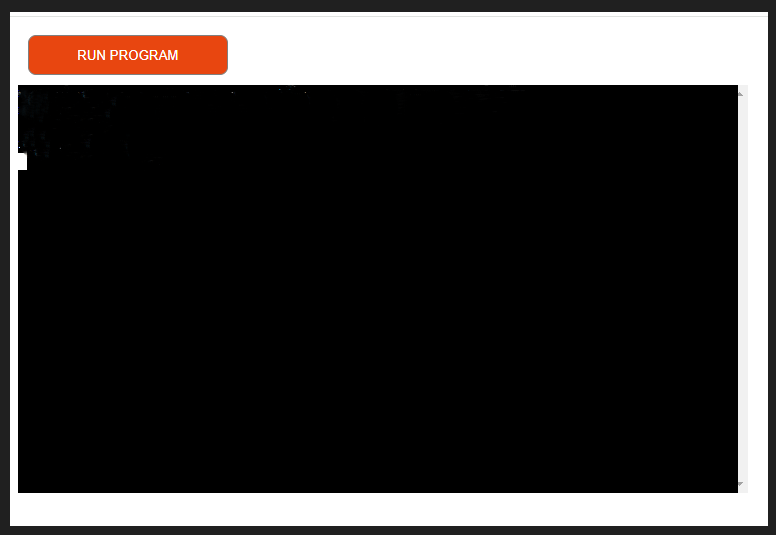
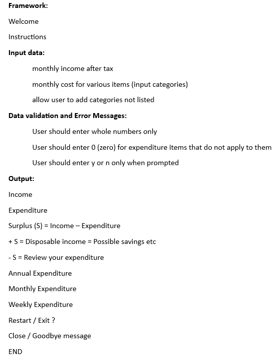
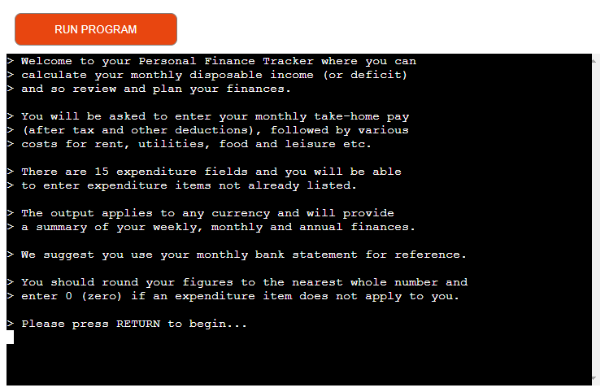

# [PERSONAL FINANCE TRACKER](https://aa-personal-finance-tracker-46a2e4082ae9.herokuapp.com)

## Project Purpose
This app will enable users to calculate their monthly disposable income, based upon input of their monthly income and expenditure, and also indicate their total weekly, monthly and annual expenditure.

Users can enter figures into 15 pre-defined expenditure fields and then add their own if necessary.

Output will consist of a list of all expenditure items and a financial summary showing their disposable income (or deficit) and total weekly, monthly and annual expenditure.

## Target Audience
The target audience is adults who wish review their ongoing finances. This includes single people, couples, and those with children and the pre-defined expenditure fields allow for a range of lifestyles with the option of adding additional categories more personal to the user.

The image below shows how the app is displayed on various devices.


## UX
### Initial Design
The overall design is informed by Code Institute's command line interface (CLI) template, to be deployed on Heroku, with the terminal set to 80 columns by 24 rows.



Before coding, I planned the flow of the application.

Firstly with a flow chart using MS Word:


Secondly with a more detailed written framework:



And finally with a draft script with text to include in the code:


### Typography
The CLI template uses Courier New.

## User Stories
As a user I would like to see instructions about the app so that I can use it.

As a user I would like to enter my financial data effectively.

As a user I would like to enter my own expenditure categories. 

As a user I would like to see a summary of my finances and disposable income.

As a user I would like to restart the app to use again or exit.

## Features

### Existing Features

- **Welcome and Instructions**

    - The first page welcomes the user to the app, outlines its purpose, and presents a clear set of instructions. The user is invited to press RETURN to begin.



- **Income Input**

    - The user is invited to enter their monthly income, instructed to press RETURN after entry, and after every subsequent data entry.


- **Pre-defined Expenditure Input**

    - The first of 15 pre-defined expenditure fields is displayed and the user is invited to enter the amount they spend in each category.


- **User-defined Expenditure Input**

    - The user is asked if they want to enter their own expenditure items.


   - If they reply with a Y for yes, they are asked to enter the name of their item and then enter its cost.


- **Expenditure Summary**

    - Details 


- **Financial Summary**

    - Details 


- **Closing Message**

    - Details 


🛑🛑🛑🛑🛑 START OF NOTES (to be deleted) 🛑🛑🛑🛑🛑

Repeat as necessary for as many features as your site contains.

Hint: the more, the merrier!

🛑🛑🛑🛑🛑 END OF NOTES (to be deleted) 🛑🛑🛑🛑🛑

### Future Features

🛑🛑🛑🛑🛑 START OF NOTES (to be deleted) 🛑🛑🛑🛑🛑

Do you have additional ideas that you'd like to include on your project in the future?
Fantastic! List them here!
It's always great to have plans for future improvements!
Consider adding any helpful links or notes to help remind you in the future, if you revisit the project in a couple years.

🛑🛑🛑🛑🛑 END OF NOTES (to be deleted) 🛑🛑🛑🛑🛑

- Title for future feature #1
    - Any additional notes about this feature.
- Title for future feature #2
    - Any additional notes about this feature.
- Title for future feature #3
    - Any additional notes about this feature.

## Tools & Technologies Used

🛑🛑🛑🛑🛑 START OF NOTES (to be deleted) 🛑🛑🛑🛑🛑

In this section, you should explain the various tools and technologies used to develop the project.
Make sure to put a link (where applicable) to the source, and explain what each was used for.
Some examples have been provided, but this is just a sample only, your project might've used others.
Feel free to delete any unused items below as necessary.

🛑🛑🛑🛑🛑 END OF NOTES (to be deleted) 🛑🛑🛑🛑🛑

- [Python](https://www.python.org) used as the back-end programming language.
- [Git](https://git-scm.com) used for version control. (`git add`, `git commit`, `git push`)
- [GitHub](https://github.com) used for secure online code storage.
- [Gitpod](https://gitpod.io) used as a cloud-based IDE for development.
- [Heroku](https://www.heroku.com) used for hosting the deployed back-end site.

## Data Model

### Flowchart

To follow best practice, a flowchart was created for the app's logic,
and mapped out before coding began using a free version of
[Lucidchart](https://www.lucidchart.com/pages/ER-diagram-symbols-and-meaning) and/or [Draw.io](https://www.draw.io).

Below is the flowchart of the main process of this Python program. It shows the entire cycle of the program.


### Classes & Functions

The program uses classes as a blueprint for the project's objects (OOP). This allows for the object to be reusable.

```python
class Person:
    """ Insert docstring comments here """
    def __init__(self, name, age, health, inventory):
        self.name = name
        self.age = age
        self.health = health
        self.inventory = inventory
```

The primary functions used on this application are:

- `get_sales_data()`
    - Get sales figures input from the user.
- `validate_data()`
    - Converts all string values into integers.
- `update_worksheet()`
    - Update the relevant worksheet with the data provided.
- `calculate_surplus_data()`
    - Compare sales with stock and calculate the surplus for each item type.
- `get_last_5_entries_sales()`
    - Collects columns of data from sales worksheet.
- `calculate_stock_data()`
    -  Calculate the average stock for each item type, adding 10%.
- `main()`
    - Run all program functions.

### Imports

I've used the following Python packages and/or external imported packages.

- `os`: used for adding a `clear()` function
- `colorama`: used for including color in the terminal

## Testing

For all testing, please refer to the [TESTING.md](TESTING.md) file.

## Deployment

Code Institute has provided a [template](https://github.com/Code-Institute-Org/python-essentials-template) to display the terminal view of this backend application in a modern web browser.
This is to improve the accessibility of the project to others.

The live deployed application can be found deployed on [Heroku](https://aa-personal-finance-tracker-46a2e4082ae9.herokuapp.com).

### Heroku Deployment

This project uses [Heroku](https://www.heroku.com), a platform as a service (PaaS) that enables developers to build, run, and operate applications entirely in the cloud.

Deployment steps are as follows, after account setup:

- Select **New** in the top-right corner of your Heroku Dashboard, and select **Create new app** from the dropdown menu.
- Your app name must be unique, and then choose a region closest to you (EU or USA), and finally, select **Create App**.
- From the new app **Settings**, click **Reveal Config Vars**, and set the value of KEY to `PORT`, and the value to `8000` then select *add*.
- If using any confidential credentials, such as CREDS.JSON, then these should be pasted in the Config Variables as well.
- Further down, to support dependencies, select **Add Buildpack**.
- The order of the buildpacks is important, select `Python` first, then `Node.js` second. (if they are not in this order, you can drag them to rearrange them)

Heroku needs two additional files in order to deploy properly.

- requirements.txt
- Procfile

You can install this project's **requirements** (where applicable) using:

- `pip3 install -r requirements.txt`

If you have your own packages that have been installed, then the requirements file needs updated using:

- `pip3 freeze --local > requirements.txt`

The **Procfile** can be created with the following command:

- `echo web: node index.js > Procfile`

For Heroku deployment, follow these steps to connect your own GitHub repository to the newly created app:

Either:

- Select **Automatic Deployment** from the Heroku app.

Or:

- In the Terminal/CLI, connect to Heroku using this command: `heroku login -i`
- Set the remote for Heroku: `heroku git:remote -a app_name` (replace *app_name* with your app name)
- After performing the standard Git `add`, `commit`, and `push` to GitHub, you can now type:
	- `git push heroku main`

The frontend terminal should now be connected and deployed to Heroku!

### Local Deployment

This project can be cloned or forked in order to make a local copy on your own system.

For either method, you will need to install any applicable packages found within the *requirements.txt* file.

- `pip3 install -r requirements.txt`.

If using any confidential credentials, such as `CREDS.json` or `env.py` data, these will need to be manually added to your own newly created project as well.

#### Cloning

You can clone the repository by following these steps:

1. Go to the [GitHub repository](https://github.com/Adam-Alive/personal-finance-tracker) 
2. Locate the Code button above the list of files and click it 
3. Select if you prefer to clone using HTTPS, SSH, or GitHub CLI and click the copy button to copy the URL to your clipboard
4. Open Git Bash or Terminal
5. Change the current working directory to the one where you want the cloned directory
6. In your IDE Terminal, type the following command to clone my repository:
	- `git clone https://github.com/Adam-Alive/personal-finance-tracker.git`
7. Press Enter to create your local clone.

Alternatively, if using Gitpod, you can click below to create your own workspace using this repository.

[](https://gitpod.io/#https://github.com/Adam-Alive/personal-finance-tracker)

Please note that in order to directly open the project in Gitpod, you need to have the browser extension installed.
A tutorial on how to do that can be found [here](https://www.gitpod.io/docs/configure/user-settings/browser-extension).

#### Forking

By forking the GitHub Repository, we make a copy of the original repository on our GitHub account to view and/or make changes without affecting the original owner's repository.
You can fork this repository by using the following steps:

1. Log in to GitHub and locate the [GitHub Repository](https://github.com/Adam-Alive/personal-finance-tracker)
2. At the top of the Repository (not top of page) just above the "Settings" Button on the menu, locate the "Fork" Button.
3. Once clicked, you should now have a copy of the original repository in your own GitHub account!

### Local VS Deployment

🛑🛑🛑🛑🛑 START OF NOTES (to be deleted) 🛑🛑🛑🛑🛑

Use this space to discuss any differences between the local version you've developed, and the live deployment site on Heroku.

🛑🛑🛑🛑🛑 END OF NOTES (to be deleted) 🛑🛑🛑🛑🛑

## Credits

🛑🛑🛑🛑🛑 START OF NOTES (to be deleted) 🛑🛑🛑🛑🛑

In this section you need to reference where you got your content, media, and extra help from.
It is common practice to use code from other repositories and tutorials,
however, it is important to be very specific about these sources to avoid plagiarism.

🛑🛑🛑🛑🛑 END OF NOTES (to be deleted) 🛑🛑🛑🛑🛑

### Content

🛑🛑🛑🛑🛑 START OF NOTES (to be deleted) 🛑🛑🛑🛑🛑

Use this space to provide attribution links to any borrowed code snippets, elements, or resources.
A few examples have been provided below to give you some ideas.

Ideally, you should provide an actual link to every resource used, not just a generic link to the main site!

🛑🛑🛑🛑🛑 END OF NOTES (to be deleted) 🛑🛑🛑🛑🛑

| Source | Location | Notes |
| --- | --- | --- |
| [Markdown Builder](https://tim.2bn.dev/markdown-builder) | README and TESTING | tool to help generate the Markdown files |
| [Chris Beams](https://chris.beams.io/posts/git-commit) | version control | "How to Write a Git Commit Message" |
| [W3Schools](https://www.w3schools.com/howto/howto_js_topnav_responsive.asp) | entire site | responsive HTML/CSS/JS navbar |
| [W3Schools](https://www.w3schools.com/howto/howto_css_modals.asp) | contact page | interactive pop-up (modal) |
| [W3Schools](https://www.w3schools.com/css/css3_variables.asp) | entire site | how to use CSS :root variables |
| [Flexbox Froggy](https://flexboxfroggy.com/) | entire site | modern responsive layouts |
| [Grid Garden](https://cssgridgarden.com) | entire site | modern responsive layouts |
| [StackOverflow](https://stackoverflow.com/a/2450976) | quiz page | Fisher-Yates/Knuth shuffle in JS |
| [YouTube](https://www.youtube.com/watch?v=YL1F4dCUlLc) | leaderboard | using `localStorage()` in JS for high scores |
| [YouTube](https://www.youtube.com/watch?v=u51Zjlnui4Y) | PP3 terminal | tutorial for adding color to the Python terminal |
| [strftime](https://strftime.org) | CRUD functionality | helpful tool to format date/time from string |
| [WhiteNoise](http://whitenoise.evans.io) | entire site | hosting static files on Heroku temporarily |

### Media

🛑🛑🛑🛑🛑 START OF NOTES (to be deleted) 🛑🛑🛑🛑🛑

Use this space to provide attribution links to any images, videos, or audio files borrowed from online.
A few examples have been provided below to give you some ideas.

If you're the owner (or a close acquaintance) of all media files, then make sure to specify this.
Let the assessors know that you have explicit rights to use the media files within your project.

Ideally, you should provide an actual link to every media file used, not just a generic link to the main site!
The list below is by no means exhaustive. Within the Code Institute Slack community, you can find more "free media" links
by sending yourself the following command: `!freemedia`.

🛑🛑🛑🛑🛑 END OF NOTES (to be deleted) 🛑🛑🛑🛑🛑

| Source | Location | Type | Notes |
| --- | --- | --- | --- |
| [Pexels](https://www.pexels.com) | entire site | image | favicon on all pages |
| [Lorem Picsum](https://picsum.photos) | home page | image | hero image background |
| [Unsplash](https://unsplash.com) | product page | image | sample of fake products |
| [Pixabay](https://pixabay.com) | gallery page | image | group of photos for gallery |
| [Wallhere](https://wallhere.com) | footer | image | background wallpaper image in the footer |
| [This Person Does Not Exist](https://thispersondoesnotexist.com) | testimonials | image | headshots of fake testimonial images |
| [Audio Micro](https://www.audiomicro.com/free-sound-effects) | game page | audio | free audio files to generate the game sounds |
| [Videvo](https://www.videvo.net/) | home page | video | background video on the hero section |
| [TinyPNG](https://tinypng.com) | entire site | image | tool for image compression |

### Acknowledgements

- I would like to thank my Code Institute mentor, [Tim Nelson](https://github.com/TravelTimN), for his invaluable advice, guidance and support throughout the development of this project.