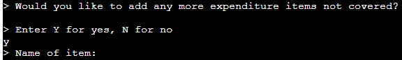
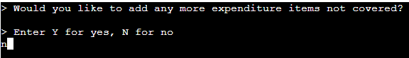
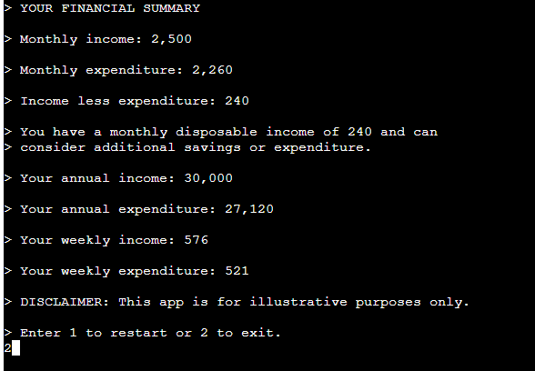
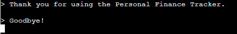

# Testing

Return back to the [README.md](README.md) file.

## Code Validation

I have used the recommended [PEP8 CI Python Linter](https://pep8ci.herokuapp.com) to validate the run.py file.

Result:
-   Pass: No Errors.

## Testing Note

Although the Code Institute CLI terminal is pre-defined, in keeping with good practice I have conducted a number of tests regarding browser compatibility, responsiveness and accessibility.

## Browser Compatibility

I've tested my deployed project on Chrome, Edge and Safari to check for compatibility issues.

I tested each browser on the landing page and have provided summary of these tests below.

| Browser | Landing Page | Notes |
| --- | --- | --- |
| Chrome |  | Works as expected |
| Edge |  | Works as expected |
| Safari |  | Works as expected |

## Responsiveness

I deployed the project early on and tested on three of my own devices throughout the development process:

Moto (g8) power

HP Desktop (24")

MacBook Air (13")

I also used Dev Tools to test on a tablet device.

I tested the responsiveness of the landing page and have provided a summary of these tests below.

| Device | Landing Page | Notes |
| --- | --- | --- |
| Moto(g8) mobile (own) |  | CLI template does not scale for mobile devices |
| Tablet (DevTools) |  | CLI template does not scale for tablet devices |
| HP Desktop (own) |  | Works as expected |
| MacBook Air (own) |  | Works as expected |

## Lighthouse Audit

I've tested my deployed project using the Lighthouse Audit tool to check for any major issues.

Results for desktop devices:

Results for mobile devices:

## Defensive Programming

Defensive programming has been manually tested and the Pass/Fail outcomes summarised below.

| Section | User Action | Expected Result | Pass/Fail | Comments | Screenshot |
| --- | --- | --- | --- | --- | --- |
| Landing Page | | | | |
| | Click on a link to access the app. | Landing page is shown. | Pass |  |   |
| | Enter return to commence app. | Refresh to Income Input terminal. | Pass |  |   |
| Income Input | | | | |
| | Enter a whole number or 0. | Refresh to Expenditure Input terminal (first item is 'Rent or mortgage') | Pass |  |   |
| | Enter character/s not a whole number or 0, eg. 'Return' only, cat, 88.0, or 3,000 | Display the error message: "> Data is not valid, please enter a whole number or 0"| Pass |  |   |
| Expenditure Input | | | | |
| | Enter a whole number or 0. | Refresh to 2nd Expenditure Input terminal ('Travel') through to 15th pre-defined item. THEN Refresh to User-defined Expenditure Input after 15th item entered.| Pass THEN Pass |  |   |
| | Enter character/s not a whole number or 0, eg. Tea, !!!, 47.50 or £500 | Display the error message: "> Data is not valid, please enter a whole number or 0" | Pass |  |  |
| User-defined Expenditure Input | | | | |
| | Enter Y. | Ask user to enter an expenditure item not already listed. | Pass |  |  |
| | Enter name of item (X). | Ask user to enter the cost of X. | Pass |  |   |
| | Enter a whole number or 0. | Ask user if they wish to enter more items (Y or N). | Pass |  |   |
| | Enter character/s not a whole number or 0, eg. maybe, 77, 'space'. | Display the error message: "> (input) is invalid. Enter Y or N." | Pass |  |   |
| | Enter N. | Refresh to Expenditure Summary terminal. | Pass |  |   |
| Expenditure Summary | | | | |
| | Enter return. | Refresh to Financial Summary terminal. | Pass |  |   |
| Financial Summary | | |  | Financial Summary shown here: |   |
| | Enter 1. | Refresh to Income Input terminal. | Pass |  |   |
| | Enter 2. | Refresh to Closing Message terminal and exit app. | Pass |  |   |
| | Enter character/s not a 1 or 2, eg. 3, y, 22 or &&&. | Display error message: "> (input) is invalid. Enter 1 or 2; > Enter 1 to restart or 2 to exit." | Pass |  |  

## User Story Testing

| User Story | Screenshot | Pass/Fail |
| --- | --- | --- |
| As a user, I would like to see instructions about the app so that I can use it.  |  | Pass |
| As a user, I would like to enter my financial data effectively so that my finances can be calculated accurately. |  | Pass |
|  |  | Pass |
| As a user, I would like to enter my own expenditure categories so that I can make the results more personal to me. |  | Pass |
|  |  | Pass |
| |  | Pass |
| |  | Pass |
| As a user, I would like to see a summary of my finances and disposable income so that I can understand my financial circumstances. |  | Pass |
| As a user, I would like to restart the app to use again so that I can check my figures, or leave the app with my data deleted. | See last line of screenshot above | Pass |
| |  | Pass |

## Bugs

-   **Issue:** To improve the user experience, I wanted to add thousand comma separators to numbers in the output. For example, an input of income 2000 would result in an output of income 2,000 and annual income 24,000.

-   I added code to apply this to income, expenditure surplus (see lines 169 - 174):

-   But when running the program it crashed and would not display the full financial summary see:

-   As shown, the TypeError involved the comparison of the surplus value with 0 in order to print out relevant message (disposable income, deficit or income matching expenditure) - see lines 183 - 190 in the code above.

-   This error confirmed that, since I had added a comma separator, the data was now a string, not an integer, so could not be processed mathematically.

-   **Fix:**
-   I therefore changed the code so that the comma separators were added after the surplus comparisons with 0. See new lines 181 and 183 below:

-   The Financial Summary was now displaying correctly, with the disposable income shown:

-   **Issue:** 
-   **Fix:**

-   **Issue:** 
-   **Fix:**

## Unfixed Bugs

You will need to mention unfixed bugs and why they were not fixed.
This section should include shortcomings of the frameworks or technologies used.

-   **Issue:** 
-   **Fix:**

-   **Issue:** 
-   **Fix:**

-   **Issue:** 
-   **Fix:**

There are no remaining bugs that I am aware of.
