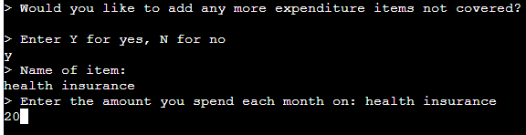

# Testing

Return back to the [README.md](README.md) file.

## Code Validation

I have used the recommended [PEP8 CI Python Linter](https://pep8ci.herokuapp.com) to validate the run.py file.

Result:
-   Pass: No Errors.

## Testing Note

Although the Code Institute CLI terminal is pre-defined, in keeping with good practice I have conducted a number of tests regarding browser compatibility, responsiveness and accessibility.

## Browser Compatibility

I've tested my deployed project on Chrome, Edge and Safari to check for compatibility issues.

I tested each browser on the landing page and have provided summary of these tests below.

| Browser | Landing Page | Notes |
| --- | --- | --- |
| Chrome |  | Works as expected |
| Edge |  | Works as expected |
| Safari |  | Works as expected |

## Responsiveness

I deployed the project early on and tested on three of my own devices throughout the development process:

Moto (g8) power

HP Desktop (24")

MacBook Air (13")

I also used Dev Tools to test on a tablet device.

I tested the responsiveness of the landing page and have provided a summary of these tests below.

| Device | Landing Page | Notes |
| --- | --- | --- |
| Moto(g8) mobile (own) |  | CLI template does not scale for mobile devices |
| Tablet (DevTools) |  | CLI template does not scale for tablet devices |
| HP Desktop (own) |  | Works as expected |
| MacBook Air (own) |  | Works as expected |

## Lighthouse Audit

I've tested my deployed project using the Lighthouse Audit tool to check for any major issues.

Results for desktop devices:

Results for mobile devices:

## Defensive Programming

Defensive programming has been manually tested and the Pass/Fail outcomes summarised below.

| Section | User Action | Expected Result | Pass/Fail | Comments | Screenshot |
| --- | --- | --- | --- | --- | --- |
| Landing Page | | | | |
| | Click on a link to access the app. | Landing page is shown. | Pass |  |   |
| | Enter return to commence app. | Refresh to Income Input terminal. | Pass |  |   |
| Income Input | | | | |
| | Enter a whole number or 0. | Refresh to Expenditure Input terminal (first item is 'Rent or mortgage') | Pass |  |   |
| | Enter character/s not a whole number or 0, eg. 'Return' only, cat, 88.0, or 3,000 | Display the error message: "> Data is not valid, please enter a whole number or 0"| Pass |  |   |
| Expenditure Input | | | | |
| | Enter a whole number or 0. | Refresh to 2nd Expenditure Input terminal ('Travel') through to 15th pre-defined item.| Pass |  |   |
| | Enter character/s not a whole number or 0, eg. Tea, !!!, 47.50 or £500 | Display the error message: "> Data is not valid, please enter a whole number or 0" | Pass |  |  |
| User-defined Expenditure Input | | | | |
| | Enter Y. | Ask user to enter an expenditure item not already listed. | Pass |  |   |
| | Enter name of item (X). | Ask user to enter the cost of X. | Pass |  |   |
| | Enter a whole number or 0. | Ask user if they wish to enter more items (Y or N). | Pass |  |   |
| | Enter character/s not a whole number or 0, eg. maybe, 77, 'space'. | Display the error message: "> (input) is invalid. Enter Y or N." | Pass |  |   |
| | Special Character input tbc and Newspapers | xxx | Pass |  |   |
| | Enter N. | Refresh to Expenditure Summary terminal. | Pass |  |   |
| Expenditure Summary | | | | |
| | Enter return. | Refresh to Financial Summary terminal. | Pass |  |   |
| Financial Summary | | | Financial Summary shown here. |  |
| | Enter 1. | Refresh to Income Input terminal. | Pass |  |   |
| | Enter 2. | Refresh to Closing Message terminal and exit app. | Pass |  |   |
| | Enter character/s not a 1 or 2, eg. 3, y, 22 or &&&. | Display error message: "> (input) is invalid. Enter 1 or 2; > Enter 1 to restart or 2 to exit." | Pass |  |   |
| | xxx | xxx | Pass |  |   |
| | xxx | xxx | Pass |  |   |
| | xxx | xxx | Pass |  |   |
| | xxx | xxx | Pass |  |   |
| | xxx | xxx | Pass |  |   |

## User Story Testing

| User Story | Screenshot | Pass/Fail |
| --- | --- | --- |
| As a user, I would like to see instructions about the app so that I can use it.  |  | Pass |
| As a user, I would like to enter my financial data effectively so that my finances can be calculated accurately. |  | Pass |
|  |  | Pass |
| As a user, I would like to enter my own expenditure categories so that I can make the results more personal to me. |  | Pass |
|  |  | Pass |
| |  | Pass |
| |  | Pass |
| As a user, I would like to see a summary of my finances and disposable income so that I can understand my financial circumstances. |  | Pass |
| As a user, I would like to restart the app to use again so that I can check my figures, or leave the app with my data deleted. | See last line of screenshot above | Pass |
| |  | Pass |

## Bugs

**PRO TIP**: screenshots of bugs are extremely helpful, and go a long way!

- JS Uncaught ReferenceError: `foobar` is undefined/not defined

    

    - To fix this, I _____________________.

- JS `'let'` or `'const'` or `'template literal syntax'` or `'arrow function syntax (=>)'` is available in ES6 (use `'esversion: 11'`) or Mozilla JS extensions (use moz).

    

    - To fix this, I _____________________.

- Python `'ModuleNotFoundError'` when trying to import module from imported package

    

    - To fix this, I _____________________.

## Unfixed Bugs

You will need to mention unfixed bugs and why they were not fixed.
This section should include shortcomings of the frameworks or technologies used.

If you've identified any unfixed bugs, no matter how small, be sure to list them here.
It's better to be honest and list them, because if it's not documented and an assessor finds the issue,
they need to know whether or not you're aware of them as well, and why you've not corrected/fixed them.

- On devices smaller than 375px, the page starts to have `overflow-x` scrolling.

    

    - Attempted fix: I tried to add additional media queries to handle this, but things started becoming too small to read.

- For PP3, when using a helper `clear()` function, any text above the height of the terminal does not clear, and remains when you scroll up.

    

    - Attempted fix: I tried to adjust the terminal size, but it only resizes the actual terminal, not the allowable area for text.

There are no remaining bugs that I am aware of.
