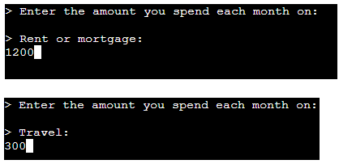

# Testing

Return back to the [README.md](README.md) file.

## Code Validation

I have used the recommended [PEP8 CI Python Linter](https://pep8ci.herokuapp.com) to validate the run.py file.

Result:
-   Pass: No Errors.

## Testing Note

Although the Code Institute CLI terminal is pre-defined, in keeping with good practice I have conducted a number of tests regarding browser compatibility, responsiveness and accessibility.

## Browser Compatibility

I've tested my deployed project on Chrome, Edge and Safari to check for compatibility issues.

I tested each browser on the landing page and have provided summary of these tests below.

| Browser | Landing Page | Notes |
| --- | --- | --- |
| Chrome |  | Works as expected |
| Edge |  | Works as expected |
| Safari |  | Works as expected |

## Responsiveness

I deployed the project early on and tested on three of my own devices throughout the development process:

Moto (g8) power

HP Desktop (24")

MacBook Air (13")

I also used Dev Tools to test on a tablet device.

I tested the responsiveness of the landing page and have provided a summary of these tests below.

| Device | Landing Page | Notes |
| --- | --- | --- |
| Moto(g8) mobile (own) |  | CLI template does not scale for mobile devices |
| Tablet (DevTools) |  | CLI template does not scale for tablet devices |
| HP Desktop (own) |  | Works as expected |
| MacBook Air (own) |  | Works as expected |

## Lighthouse Audit

I've tested my deployed project using the Lighthouse Audit tool to check for any major issues.

Results for desktop devices:

Results for mobile devices:

## Defensive Programming

Defensive programming has been manually tested and the Pass/Fail outcomes summarised below.

| Section | User Action | Expected Result | Pass/Fail | Comments | Screenshot |
| --- | --- | --- | --- | --- | --- |
| Title | | | | |
| | Click on Logo | Redirection to Home page | Pass | |
| | Click on Home link in navbar | Redirection to Home page | Pass | |
| Title  | | | | |
| | Click on Gallery link in navbar | Redirection to Gallery page | Pass | |
| | Load gallery images | All images load as expected | Pass | |
| Title | | | | |
| | Click on Contact link in navbar | Redirection to Contact page | Pass | |
| | Enter first/last name | Field will accept freeform text | Pass | |
| | Enter valid email address | Field will only accept email address format | Pass | |
| | Enter message in textarea | Field will accept freeform text | Pass | |
| | Click the Submit button | Redirects user to form-dump | Pass | User must click 'Back' button to return |
| Title | | | | |
| | Click on Sign Up button | Redirection to Sign Up page | Pass | |
| | Enter valid email address | Field will only accept email address format | Pass | |
| | Enter valid password (twice) | Field will only accept password format | Pass | |
| | Click on Sign Up button | Asks user to confirm email page | Pass | Email sent to user |
| | Confirm email | Redirects user to blank Sign In page | Pass | |
| Title | | | | |
| | Click on the Login link | Redirection to Login page | Pass | |
| | Enter valid email address | Field will only accept email address format | Pass | |
| | Enter valid password | Field will only accept password format | Pass | |
| | Click Login button | Redirects user to home page | Pass | |
| Title | | | | |
| | Click Logout button | Redirects user to logout page | Pass | Confirms logout first |
| | Click Confirm Logout button | Redirects user to home page | Pass | |
| Title | | | | |
| | Click on Profile button | User will be redirected to the Profile page | Pass | |
| | Click on the Edit button | User will be redirected to the edit profile page | Pass | |
| | Click on the My Orders link | User will be redirected to the My Orders page | Pass | |

| repeat for all remaining pages | x | x | x | x |

## User Story Testing

| User Story | Screenshot | Pass/Fail |
| --- | --- | --- |
| As a user, I would like to see instructions about the app so that I can use it.  |  | Pass |
| As a user, I would like to enter my financial data effectively so that my finances can be calculated accurately. |  | Pass |
|  |  | Pass |
| As a user, I would like to enter my own expenditure categories so that I can make the results more personal to me. |  | Pass |
|  |  | Pass |
| |  | Pass |
| |  | Pass |
| As a user, I would like to see a summary of my finances and disposable income so that I can understand my financial circumstances. |  | Pass |
| As a user, I would like to restart the app to use again so that I can check my figures, or leave the app with my data deleted. | See last line of screenshot above | Pass |
| |  | Pass |

## Bugs

**PRO TIP**: screenshots of bugs are extremely helpful, and go a long way!

- JS Uncaught ReferenceError: `foobar` is undefined/not defined

    

    - To fix this, I _____________________.

- JS `'let'` or `'const'` or `'template literal syntax'` or `'arrow function syntax (=>)'` is available in ES6 (use `'esversion: 11'`) or Mozilla JS extensions (use moz).

    

    - To fix this, I _____________________.

- Python `'ModuleNotFoundError'` when trying to import module from imported package

    

    - To fix this, I _____________________.

## Unfixed Bugs

You will need to mention unfixed bugs and why they were not fixed.
This section should include shortcomings of the frameworks or technologies used.

If you've identified any unfixed bugs, no matter how small, be sure to list them here.
It's better to be honest and list them, because if it's not documented and an assessor finds the issue,
they need to know whether or not you're aware of them as well, and why you've not corrected/fixed them.

- On devices smaller than 375px, the page starts to have `overflow-x` scrolling.

    

    - Attempted fix: I tried to add additional media queries to handle this, but things started becoming too small to read.

- For PP3, when using a helper `clear()` function, any text above the height of the terminal does not clear, and remains when you scroll up.

    

    - Attempted fix: I tried to adjust the terminal size, but it only resizes the actual terminal, not the allowable area for text.

There are no remaining bugs that I am aware of.
